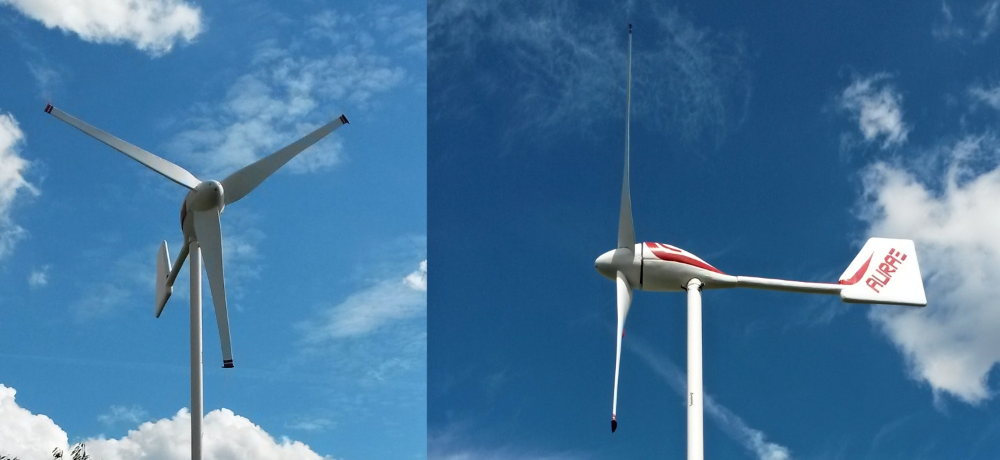
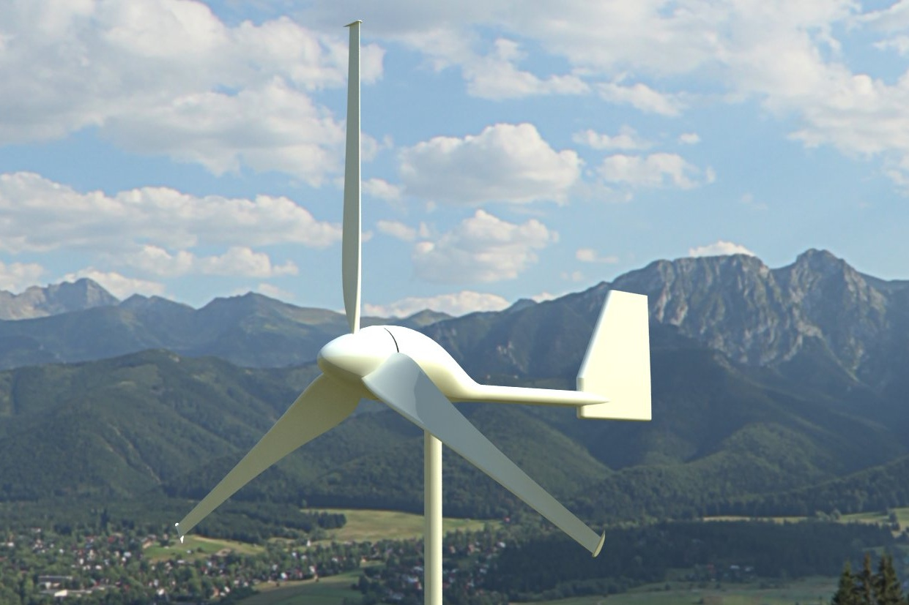

# Aurae

A small, efficient and low-cost wind turbine.

# About the project

I always liked wind turbines. So I looked to the theory back in 2012 and I wrote
[a thesis about designing small turbines](https://github.com/yaqwsx/SOC---Design-of-a-small-Wind-Turbine) at high school. I describe there a new
turbine design, however I didn't manufactured it. Few years later, I found free
time and build it. This repository contains all source 3D model of the turbine and
all the helpers and templates used during the manufacturing. 

The manufacturing process is the same I described in the thesis. I have
documented it well, however my SD card with all the photos died. [This video](https://www.youtube.com/watch?v=jKSemOqdHwo)
is the only file, that survived.

# 3D model

Everything was modeled in student version of SolidWorks and it can be found in 
[model](model) directory.

